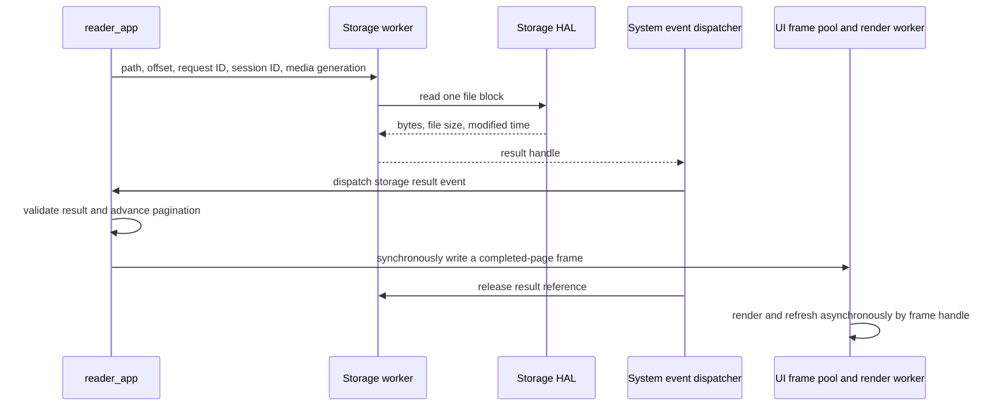

# How the TXT Reader Works

The TXT Reader opens text files on the SD card through FileApp, reads them in blocks through StorageService, paginates visible content in the application layer, and submits immutable frames to the UI renderer. A background worker builds a complete page index. The index and resume position are stored under `/.system` on the SD card.

## Entry and loading flow

1. `file_app` recognizes `.txt` without regard to case. When a file is selected, it builds the full logical path and calls `reader_make_launch_context()` with the path, the SD-card `media_generation`, and the book format. It then passes the generic context to `app_request_launch()`.
2. App Runtime owns one bounded `app_launch_context` until the deferred switch. It passes the context to the target application's `prepare_launch()` and then clears it. Reader-specific validation and decoding stay in `app/reader/reader_launch.hpp`; App Runtime does not inspect Reader fields. A logical path starts with `/`, is at most 512 bytes, and is independent of the shortened name shown by FileApp.
3. `reader_app::on_open()` starts a session, resets all runtime state and page history, obtains the text layout, and submits foreground content and BookService open requests. TXT foreground reading starts at offset `0`, so the first visible page does not wait for a full-book scan.
4. The BookService `book_index_engine` worker checks metadata and the index on the SD card. When pagination versions and resume data are valid, Reader restores the saved location. A pagination-version mismatch discards the old index and progress, opens the first page, and rebuilds from the beginning without using an old page or byte offset. A background result cannot move the view back to the opening position after the user has navigated.
5. Visible pages remain demand-loaded. After the complete index is validated, Reader can query page offsets by page number and show the current and total page counts.

Clicking the middle content zone opens the top menu. Clicking `<` in that menu calls `app_request_back()`. App Runtime applies the return history. After Reader closes, FileApp restores its directory and list page and reloads the directory. Opening and closing Reader both reset the menu to hidden.

Source: [file entry](../app/file/file_app.cpp), [App Runtime](../app/app.cpp), [app registry](../app/app_registry.cpp), [generic launch context](../app/include/app/app_launch_context.hpp), [Reader launch data](../app/reader/reader_launch.hpp), and [Reader](../app/reader/reader_app.cpp).

## Architecture layers

| Layer | Reader responsibility | Implementation |
| --- | --- | --- |
| `core` | Shared data contracts and base algorithms | Defines app events, result handles, book events, page structures, UTF-8 routines, and the shared paginator. Foreground and background pagination use the same algorithm. |
| `m5_hal` | Device and file-system operations | PaperMono storage maps logical paths to the SD mount and performs open, seek, read, write, and close operations. Display interfaces draw and refresh the device. |
| `services` | Storage access and book caches | StorageService uses a worker, queues, and a result pool for visible TXT blocks. The lower-priority BookService worker validates, builds, and queries indexes and reads or writes JSON progress. |
| `app` | Reading behavior and content state | `reader_app` groups state into session, page, content-request, book/index, cover, navigation, and presentation records. It owns a stable body snapshot for menu updates and invokes the shared paginator. App Runtime only owns generic launch bytes, switching, and return history. |
| `ui` | Layout metrics, presentation, and interaction mapping | Supplies glyph widths, line counts, and regions; copies Reader state into the frame pool; renders frames on a worker; and maps coordinates to page, menu, and return actions. |
| `system` | Application updates and event delivery | The system loop updates the active application. The dispatcher collects input, storage results, and book events, delivers them to the active app, and releases result references afterward. |

Visible-page pagination advances in application event handling. Full-book pagination, SD I/O, and display rendering run in their respective workers. ReaderApp requests data through service interfaces and submits state through UI interfaces; it does not access the file system or hardware directly, and services do not render UI.

Source: [shared events](../core/include/core/app_event.hpp), [layout contract](../core/include/core/text_layout.hpp), [system loop](../system/system_runtime.cpp), [event dispatcher](../system/system_event_dispatcher.cpp), [interaction router](../ui/ui_interaction_router.cpp), and [UI renderer](../ui/paper_mono/ui_renderer.cpp).

## Data transfer and lifetime



### File blocks

`storage_service_read_file_chunk()` enqueues a request containing a copied path. Reader waits for only one foreground block at a time. A block contains at most 2048 bytes. A page may consume several blocks or end partway through one; the next page reads again from its exact file offset.

The storage worker constructs `storage_file_chunk_result` values in a shared four-slot result pool. A result contains its data length, byte array, file size, modified time, end marker, and request identifiers. The result queue carries only a `result_handle`; its slot and generation identify and validate the pooled object.

The event dispatcher retains the result while it calls the application. Reader resolves the matching type, consumes the bytes synchronously, and does not retain a raw pointer across updates. The dispatcher then releases the reference so the slot can be reused.

Reader accepts a file block only when all of these fields match:

| Field | Purpose |
| --- | --- |
| `session_id` | Rejects results from a session that has closed or been reopened. |
| `request_id` | Matches the currently outstanding read. |
| `media_generation` | Separates results from SD cards before and after removal or replacement. |
| `offset` | Confirms that the result starts at the requested file position. |

Within the file-system mutex, the HAL performs `fopen → fstat → fseeko → fread → fclose` for every block. Card unmount uses the same mutex. File handles are not retained between requests, and StorageService checks media state and generation before and after the read.

Source: [storage interface and result type](../services/include/services/storage_service.hpp), [queue and result pool](../services/storage/storage_service.cpp), [block-read wrapper](../services/storage/storage_file_reader.cpp), and [PaperMono storage HAL](../m5_hal/paper_mono/paper_mono_storage.cpp).

BookService commands are also copied into a queue. A `book_service_event` carries only small values such as session, media generation, page, offset, page count, and status through `SystemEventDispatcher`. The complete index remains on the SD card and does not enter an event or UI frame.

### Page frames

Reader calls `ui_write_reader_frame()`. Its writer callback synchronously copies the stable body snapshot, navigation availability, and `menu_visible` into the UI frame pool. The submission queue carries a frame handle. The render worker retains that frame; the application object and callback context pointer never enter the render queue. A menu toggle reuses the stable body snapshot rather than exposing a paginator that is still loading.

The UI updates the presented-frame record only after a successful screen refresh. The interaction router validates actions against the presented controls and view generation, and Reader also checks its loading state. Content generation, asynchronous presentation, and touch handling therefore have separate state boundaries.

Source: [Reader view](../ui/include/ui/reader_view.hpp), [frame pool](../ui/paper_mono/ui_frame_pool.cpp), [render scheduling](../ui/paper_mono/ui_renderer.cpp), and [presented-frame state](../ui/ui_presentation.cpp).

## Decoding, layout, and page navigation

The body uses strict UTF-8 decoding. A buffer of up to four pending bytes joins a multibyte character across file blocks. An invalid sequence, including an incomplete sequence at EOF, produces `invalid_utf8`.

Text processing follows these rules:

- Only a UTF-8 BOM at the start of the file is ignored.
- LF, CR, and CRLF are recognized; blank lines still occupy lines.
- A tab becomes one space. Other controls below `0x20`, and `0x7F`, render as `?`.
- Wrapping uses the actual glyph width character by character; an English word may break between characters.
- PaperMono measures and draws with `efontCN_24`. Missing glyphs and code points above `0xFFFF` render as `?`.

The PaperMono display is 480 × 800 pixels. The status bar occupies `y=[760,800)`. The Reader content region is `(0,0,480,760)` and has no persistent bottom navigation bar. Text uses `(24,16,432,720)`, a 30-pixel line height, and at most 24 lines per page; the final line box ends at `y=736`. `layout.hpp` defines the bounds and line count, and `ui_reader_text_layout()` supplies identical width, count, and font metrics to foreground and background paginators and to drawing.

Removing the former 80-pixel bottom navigation area increased a page from 21 to 24 lines. Return is in the top menu, and content zones handle paging.

The shared `reader_page` reserves 32 line records and a 2048-byte text array including its terminating null. When the line or text capacity is reached, the paginator records the next source-file character offset as the next-page entry.

`reader_line.offset` and `length` are byte ranges in the page's text array for the renderer. Page-start and next-page offsets are 64-bit positions in the source file. Newline normalization and tab replacement do not convert source positions into page-local positions.

When the index and current page number are valid, a page turn first queries the target page offset in `pages.idx`. Before the index is ready, next uses `next_page_start_offset`; previous uses `reader_page_history`, which stores at most 64 entries and drops the oldest when full.

If there is no valid index and history cannot provide the previous page, Reader paginates again from the file start to locate the page before the target. This uses fixed-capacity state, but the amount read increases with the target position. History exists only for the current Reader session.

Source: [shared paginator and history](../core/text_paginator.cpp), [paginator interface](../core/include/core/text_paginator.hpp), [UTF-8 routines](../core/include/core/utf8.hpp), [font metrics](../ui/paper_mono/text_layout.cpp), [page layout](../ui/paper_mono/layout.hpp), and [page renderer](../ui/paper_mono/views/reader_renderer.cpp).

## Click regions and top menu

Input follows `InputService → UIInteractionRouter → ui_action_event → ReaderApp`. ReaderApp consumes semantic actions, not coordinates.

The following half-open regions exclude the status bar:

| Region | Range | Menu hidden | Menu visible |
| --- | --- | --- | --- |
| Left | `x=[0,160), y=[0,760)` | Previous page | Paging disabled; `<` in the top menu is handled separately. |
| Center | `x=[160,320), y=[0,760)` | Show menu | `y=[80,760)` hides the menu; blank top-menu space has no action. |
| Right | `x=[320,480), y=[0,760)` | Next page | Paging disabled. |
| Top menu | `x=[0,480), y=[0,80)` | Absent | Receives clicks first and blocks content actions. |
| `<` | `x=[0,160), y=[0,80)` | Absent | Return to FileApp. |

Press captures a hit region, and only a normal click on release emits an action. Release validates the currently presented state and hit region again. Movement over 20 pixels, crossing regions, and long press do not emit Reader actions. Content zones and `<` do not request inverted press feedback. Previous is disabled at the first page and next at the last page; paging is disabled during loading. The menu remains available on loading and error pages.

ReaderApp owns menu state, passes `reader_view_state.menu_visible` in the frame, and the renderer only consumes view data. The menu has hidden and visible states. Each toggle submits a stable frame instead of an animated transition. `<` is left aligned; PaperMono layout functions define its item and menu rectangles.

Drawing order is body, menu background, then menu text. The menu covers the top of the body without changing text layout, page start, or pagination parameters and without rebuilding the index. Hiding it redraws the body underneath.

A menu toggle submits `popup_changed`; the UI selects the `reader_menu` region and `text` waveform. A normal page turn uses `reader_content`. Although the frame buffer recomposes the body, the usual screen update covers only the top 80 pixels. If queue merging finds that the body differs from the last successfully presented body, the update expands to the full Reader content region. Menu and body updates share the ghosting counter; every twentieth text refresh may upgrade to full-screen quality. Status-bar cleanup and HAL refresh upgrades follow the existing policy. ReaderApp does not select hardware refresh modes.

## SD data directory and versions

```text
/.system/books/<book_id>/
    metadata.json
    pages.idx
    metadata.json.tmp    # used while writing
    pages.idx.tmp        # used while building
```

`book_id` is the SHA-256 of the normalized logical path, written as 64 lowercase hexadecimal characters. It locates the directory only. Metadata loading also compares `canonical_path`; a different path in the same hash directory is an error and is neither used nor overwritten.

All derived data stays under `.system`. The source TXT is unchanged and no adjacent sidecar is created. FileApp hides `.system` at the SD root using FAT-style case-insensitive comparison; other dot-prefixed directories are unaffected. Deleting `.system` removes indexes and resume positions. Opening a book afterward starts at the beginning and rebuilds its index.

The three version constants are defined in [book_types.hpp](../core/include/core/book_types.hpp):

| Constant | Value | Controls |
| --- | --- | --- |
| `BOOK_METADATA_SCHEMA_VERSION` | `1` | JSON structure. Only an equal schema is accepted. |
| `BOOK_PAGE_INDEX_FORMAT_VERSION` | `1` | Binary index encoding. |
| `BOOK_PAGINATION_VERSION` | `2` | Font metrics, content layout, and pagination rules. A mismatch discards old index and progress and rebuilds from page one. |

Pagination version 2 represents the content height after bottom navigation was removed. The JSON structure, 48-byte index header, and 64-bit offset encoding did not change, so schema and index format remain at version 1. Even when TXT size, mtime, and all three fingerprints match, a version-1 pagination cache is not reused; neither `progress.page` nor `progress.byte_offset` restores it.

## metadata.json and resume position

Metadata is JSON. CRC values are computed by the service, and page numbers are zero based:

```json
{
  "schema_version": 1,
  "canonical_path": "/Books/example.txt",
  "file": {
    "size": 1234567,
    "mtime": 1788400000,
    "fingerprint": {
      "algorithm": "crc32-4k-3point-v1",
      "head": 123456789,
      "middle": 987654321,
      "tail": 135724680
    }
  },
  "pagination": {
    "index_format_version": 1,
    "pagination_version": 2,
    "complete": true,
    "page_count": 1234,
    "offsets_crc32": 246813579
  },
  "progress": {
    "page": 157,
    "byte_offset": 183421
  }
}
```

When progress has been saved before indexing completes, `complete=false`, `page_count=0`, `offsets_crc32=0`, and `progress.page=0`; `byte_offset` still stores the reading position. Such a record provides a resume offset but no total page count.

JSON is limited to less than 4096 bytes. Before parsing, the service limits nesting and structural counts, then checks required fields, types, duplicate keys, and ranges. Numbers must be nonnegative integers. A 64-bit position or timestamp is also limited by the JSON exact-integer maximum `2^53−1`; actual I/O is further limited by the file system and `off_t`.

The implemented “bookmark” is one automatic file-level resume position, not a list of named bookmarks. With a valid index, restore uses `progress.page` to query the page start. If pagination version and file identity match but the index is missing or damaged, a valid `byte_offset` can locate the greatest rebuilt page start that does not exceed that offset. A pagination-version mismatch does not use this path: old page, offset, and index data are discarded, the first page opens, and indexing restarts from the beginning.

Progress first lives in RAM. `reader_app::on_close()` enqueues the start offset of the last completed page, and BookService safely writes metadata in the background. The command queue reserves one slot for normal close-time saving. Page-index queries do not write metadata. Completing an index also writes full metadata.

Reader persistence comes only from the SD card. It does not read, write, migrate, or erase an older Reader NVS record. If SD persistence fails, the service reports an error and the view can show `Progress: RAM only`. Power-loss recovery uses the most recent metadata replacement that completed successfully.

Source: [JSON and binary codecs](../services/book/book_format.cpp), [BookService interface](../services/include/services/book_service.hpp), and [Reader close-time save](../app/reader/reader_app.cpp).

## pages.idx format and queries

All integers use explicit-width little-endian encoding; C++ object memory is never written directly. A 48-byte header is followed by `uint64_t` page-start offsets. The 64-bit width matches existing Reader and Storage position interfaces; the HAL still enforces file-system limits.

| File offset | Length | Contents |
| --- | --- | --- |
| `0` | 8 | Magic: ASCII `SSBIDX01` |
| `8` | 4 | Format version |
| `12` | 4 | Pagination version |
| `16` | 4 | Offset width, fixed at `8` |
| `20` | 4 | Page count |
| `24` | 8 | TXT file size |
| `32` | 4 | CRC32 of all encoded offsets |
| `36` | 4 | CRC32 of the first 36 header bytes |
| `40` | 8 | Reserved, must be `0` |
| `48` | `8 × page_count` | Page-start byte offsets in the original TXT |

Page `p` is at `48 + 8 × p` and can be read directly. Offset-to-page lookup performs binary search on the file without loading the table into RAM. Page `0` must have offset `0`; later offsets strictly increase and remain below TXT size. An empty file has one page at offset `0`.

The service checks magic, both index-related versions, width, header checksum, reserved bytes, page count, and exact file length, then checks all offsets and their CRC32 in blocks. Metadata page count and offset CRC32 must match the header. A damaged, truncated, or mismatched cache is rebuilt.

Source: [format definitions](../services/book/book_format.hpp) and [index engine](../services/book/book_index_engine.cpp).

## Fingerprint and cache validation

`crc32-4k-3point-v1` uses reflected CRC32/IEEE with polynomial `0xEDB88320`. For a file of size `S`, let `L=min(4096,S)`; all three windows have length `L`:

- head starts at `0`;
- middle starts at `min(max(floor(S/2)−2048, 0), S−L)`;
- tail starts at `S−L`.

Small files may have overlapping windows, and an empty window has CRC `0`. Initial indexing reads at most 12 KiB of additional samples.

Cache handling is:

1. Check the existence and supported schema, format, and pagination versions of metadata and index.
2. Rebuild when file size differs.
3. When versions, header, size, and mtime match, validate index structure without reading TXT fingerprint samples. A pagination-version mismatch starts from the beginning and recomputes the fingerprint.
4. When mtime differs, read all three windows. Matching CRC values reuse the index and safely update mtime after structural validation; a mismatch rebuilds.
5. Publish a `ready` event with a valid total only after the complete index is validated.

The samples detect ordinary changes. They are neither a full content hash nor an authentication mechanism. A change that preserves size and mtime, or avoids all three sample windows, can retain an old index.

## Background building, writes, and media changes

BookService uses the `book_worker` task with a 12288-byte stack and priority `2`; foreground storage uses priority `4`. The index engine advances by one page or one block per step and yields after processing. Bytes remaining in its buffer may continue into the next page.

Building first creates `pages.idx.tmp`. A 4 KiB scan buffer feeds the shared paginator. Page starts accumulate in a 512-byte offset buffer and are written incrementally. At EOF, the engine writes the complete header, reads the temporary index back for validation, replaces the final index, and writes complete metadata.

The HAL performs `write → flush → fsync → close` before replacing a final file. FAT replacement may remove the old destination before rename, so power loss can leave a missing file or a mismatched pair; loading rejects either condition. `.tmp` files are never loading sources and can be overwritten by a later build.

Each background SD operation passes through StorageService access control. If foreground work is pending, it waits; after acquiring access it rechecks storage state and `media_generation`. Media-generation changes, mount, and unmount use the same gate so an old task cannot write to a replacement card. File handles are not retained for long periods.

The current index may continue building after Reader closes; the closed session no longer updates the page or status bar. Reopening the same path on the same media generation can attach to that build. Opening another book cancels it, and any temporary file is not treated as a valid index. A completed cache is validated again when opened.

Major fixed allocations include a 4096-byte scan buffer, a 4096-byte JSON buffer, a 512-byte offset buffer, one paginator, the 12288-byte worker stack, and fixed command and event queues. The ESP32-S3 build reports a 12168-byte index engine object. The complete page table does not reside in RAM. An index for 10,000 pages occupies `48 + 10000 × 8 = 80048` bytes plus metadata; a rebuild also uses temporary-file space.

Source: [background worker and I/O adapter](../services/book/book_service.cpp), [incremental index engine](../services/book/book_index_engine.cpp), and [storage access control](../services/storage/storage_service.cpp).

## Status-bar page number

App switching updates the status bar's `foreground_app`. After Reader receives a validated index and confirms the current page number, it updates `reader_page_valid`, `current_page`, and `total_pages`; the UI renders a protected copy of that state.

Internal page numbers start at `0` and display as one based. The number is hidden before index validation and while a cover is shown. Leaving Reader or entering another app clears the validity flag. The renderer does not query ReaderApp or BookService.

`/` is centered. The current page is right aligned to its left and the total is left aligned to its right, without leading zeros. If either value exceeds `999999`, the number region is hidden and a warning is logged; the internal value is not truncated or clamped.

Source: [status-bar state](../ui/status_bar.cpp), [page-number layout](../ui/include/ui/reader_status_layout.hpp), and [rendering](../ui/paper_mono/ui_renderer.cpp).

## States and resource boundaries

The Reader view distinguishes `loading`, `ready`, `empty_file`, `invalid_utf8`, `file_not_found`, `storage_error`, and `no_card`. The first open submits a loading frame. Later page loads submit an additional loading frame only after 400 ms. A foreground block request that waits 10 seconds enters a read-error state.

Reader checks SD state, media generation, file size, and modified time during reads. Invalid media requires reopening the file. A metadata change stops pagination and disqualifies the current session's page start from saving.

Reader runtime state is reset as a unit on open and close. The pre-open fields in `session_state` hold only validated launch data and are copied across the open-time reset; the same record then identifies the active file and media. `page_state` owns position and view status; `content_request_state` owns the outstanding content read; `book_state` owns persistence and index coordination; `cover_state`, `navigation_state`, and `presentation_state` own their respective lifecycles. `session_serial_` remains outside the reset group so late results cannot match a new session.

Left and right body zones move to previous and next pages, while the center controls the top menu. With the menu visible, only `<` returns or the center area below it closes the menu. The UI scheduler and refresh policy choose the e-paper waveform.

Body blocks, a page, the background scan, launch data, and back history all have fixed capacity and do not grow with TXT length. SD exhaustion, directory failures, JSON or index damage, and I/O failures are returned as service errors. Valid foreground text may remain readable, but an invalid index does not provide page numbers.

Index validation reads all page starts sequentially, so its cost grows with page count, but it does not rescan unchanged TXT body text. Only one book is indexed in the background at a time. Power loss can discard unsaved progress, and interrupted FAT directory updates can require a cache rebuild on the next open.
