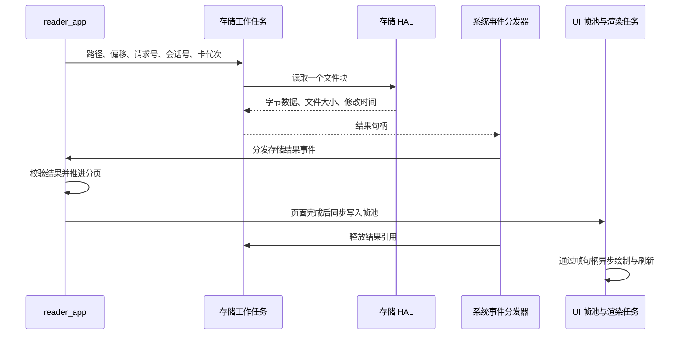

# TXT 阅读器工作方式

TXT 阅读器由文件管理器打开 SD 卡中的文本文件，通过存储服务分块读取，在应用层分页，再由 UI 渲染任务显示。后台建立完整的页号索引，索引和续读位置统一保存在 SD 卡的 `/.system` 中。

## 入口与加载流程

1. 文件管理器 `file_app` 识别 `.txt` 扩展名，比较时不区分大小写。点击文件后，将完整逻辑路径和 SD 卡代次 `media_generation` 交给 `app_request_open_reader()`。
2. 应用运行时将启动参数复制到 `app_launch_context`，通过 `prepare_launch()` 交给 `reader_app`，然后切换到注册名称为 `ReaderApp` 的应用。路径以 `/` 开头，最多 512 字节；传递的是完整路径，不是界面上排版后的文件名。
3. `reader_app::on_open()` 建立阅读会话、清空回退历史、获取排版参数，并同时提交前台正文读取和 BookIndexService 打开请求。前台先从偏移 `0` 生成可见页面，不等待全书扫描。
4. BookIndexService 在独立工作任务中检查 SD 上的 metadata 与索引。取得可用续读信息后，阅读器恢复到保存位置；缓存不可用时，工作任务增量建立完整索引。用户已经主动翻页后，后台结果不再把视图跳回打开时的续读位置。
5. 每页正文仍按需读取。完整索引验证通过后，阅读器可以按页号查询字节偏移，并在状态栏显示当前页及总页数。

返回操作由应用运行时处理。关闭阅读器后，文件管理器恢复原目录及列表页，并重新获取目录内容。

源码：[文件入口](../app/file/file_app.cpp)、[应用运行时](../app/app.cpp)、[应用注册](../app/app_registry.cpp)、[启动参数](../app/include/app/app_launch_context.hpp)、[阅读器](../app/reader/reader_app.cpp)。

## 架构分层

| 层级 | 阅读器中的职责 | 实现方式 |
| --- | --- | --- |
| `core` | 定义公共数据契约和基础算法 | 提供应用事件、结果句柄、书籍事件、页结构、UTF-8 编解码及共享分页器。前台和后台执行同一分页算法。 |
| `m5_hal` | 封装设备与文件系统操作 | PaperMono 存储实现将逻辑路径映射到 SD 挂载路径，完成文件打开、定位、读取和关闭；显示接口负责设备绘制与刷新。 |
| `services` | 提供存储访问及书籍缓存 | StorageService 使用工作任务、队列和结果池读取前台数据；BookIndexService 在低优先级任务中校验、建立和查询索引，并读写 JSON 进度。 |
| `app` | 管理阅读行为与内容状态 | `reader_app` 维护会话、请求、翻页和错误状态；`reader_paginator` 解码并分页；应用运行时负责启动参数和返回导航。 |
| `ui` | 提供排版度量、展示和交互映射 | 提供字宽与行数，将阅读状态复制到帧池，由渲染任务绘制；交互路由把触摸转换为返回、上一页和下一页动作。 |
| `system` | 驱动应用并分发事件 | 系统运行循环更新应用；事件分发器收集输入、存储结果及书籍事件，交给活动应用，分发后释放存储结果引用。 |

可见页面的分页在应用事件处理过程中推进；后台全书分页、SD 读取和屏幕渲染分别在对应工作任务中执行。应用通过服务接口请求数据，通过 UI 接口提交状态。ReaderApp 不直接访问文件系统或设备，服务不绘制 UI。

源码：[公共事件](../core/include/core/app_event.hpp)、[排版契约](../core/include/core/text_layout.hpp)、[系统循环](../system/system_runtime.cpp)、[事件分发](../system/system_event_dispatcher.cpp)、[交互路由](../ui/ui_interaction_router.cpp)、[UI 渲染](../ui/paper_mono/ui_renderer.cpp)。

## 数据传递与生命周期



### 文件块

`storage_service_read_file_chunk()` 将包含路径的请求按值放入队列。阅读器同一时刻只等待一个文件块结果；单块容量为 2048 字节。一页可以由多个块拼出，也可以在一个块内结束，剩余内容在下一页按文件偏移重新读取。

存储工作任务在共享的 4 槽结果池中构造 `storage_file_chunk_result`。该结构包含实际数据长度、字节数组、文件大小、修改时间、结束标记，以及请求的标识信息。结果队列只传递 `result_handle`，其中的槽位和代次用于定位并校验池内对象。

事件分发器在调用应用期间持有结果引用。阅读器通过类型对应的解析接口取得数据，同步消费后返回；不把结果的裸指针保留到下次更新。分发器随后释放引用，槽位可被复用。

阅读器只有在以下信息均匹配时才处理结果：

| 字段 | 校验目的 |
| --- | --- |
| `session_id` | 区分不同的阅读会话，排除关闭或重新打开前的结果。 |
| `request_id` | 匹配正在等待的那次读取。 |
| `media_generation` | 区分 SD 卡插拔前后的介质状态。 |
| `offset` | 确认结果来自本次请求的文件字节位置。 |

每个文件块都由 HAL 在文件系统互斥锁内完成 `fopen → fstat → fseeko → fread → fclose`。卡卸载使用同一把锁；跨请求不保留打开的文件句柄。存储服务在读取前后检查介质状态和代次。

源码：[存储接口与结果结构](../services/include/services/storage_service.hpp)、[队列与结果池](../services/storage/storage_service.cpp)、[块读取封装](../services/storage/storage_file_reader.cpp)、[PaperMono 存储 HAL](../m5_hal/paper_mono/paper_mono_storage.cpp)。

BookIndexService 的命令也按值入队。返回的 `book_service_event` 只包含会话、卡代次、页号、偏移、总页数和状态等小型值数据，经 `SystemEventDispatcher` 送达 ReaderApp。完整索引留在 SD 上，不进入事件或 UI 帧。

### 页面帧

阅读器调用 `ui_write_reader_frame()`，其写入回调同步把页面和按钮状态复制到 UI 帧池。提交队列传递帧句柄，渲染任务持有对应引用进行绘制；应用对象和写入回调的上下文指针不进入渲染队列。

屏幕刷新成功后，UI 才更新已呈现帧记录。交互路由依据已呈现帧的控件状态以及视图代次判断动作，阅读器还会检查自身是否正在加载。这样，内容生成、异步显示和触摸处理各自有明确的状态边界。

源码：[阅读视图结构](../ui/include/ui/reader_view.hpp)、[帧池](../ui/paper_mono/ui_frame_pool.cpp)、[渲染调度](../ui/paper_mono/ui_renderer.cpp)、[已呈现帧管理](../ui/ui_presentation.cpp)。

## 解码、排版与翻页

正文使用严格 UTF-8 解码，跨文件块的多字节字符由最多 4 字节的待解码缓冲衔接。非法序列或文件末尾不完整的序列进入 `invalid_utf8` 状态。

文本处理规则如下：

- 仅忽略文件开头的 UTF-8 BOM。
- 识别 LF、CR 和 CRLF 换行，保留空行占用的行数。
- 制表符转换为一个空格；其他小于 `0x20` 的控制字符和 `0x7F` 显示为 `?`。
- 使用字体实际字宽逐字符换行，英文单词也可以在字符之间断行。
- PaperMono 使用 `efontCN_24` 度量与绘制；字体缺少的字符以及大于 `0xFFFF` 的码点显示为 `?`。

PaperMono 正文宽度为 432 像素，每页最多 21 行。通用 `reader_page` 预留 32 条行记录和 2048 字节文本数组，文本数组含结尾的空字符。当行数或文本容量到达边界时，分页器记录下一字符在原文件中的位置，作为下一页入口。

`reader_line.offset` 和 `length` 是本页文本数组内的字节范围，供 UI 绘制使用。页首和下一页偏移则是原文件中的 64 位字节位置；换行归一化、制表符替换等处理不会把文件位置变成页内位置。

索引及当前页号有效时，翻页先查询目标页在 `pages.idx` 中的偏移，再读取正文。索引尚未完成时，下一页从 `next_page_start_offset` 开始；上一页使用最多 64 项的 `reader_page_history`。历史满时移除最早的一项。

没有可用索引且回退历史不足时，上一页操作从文件开头重新分页，定位目标前的一页。该过程使用固定容量状态，读取量随目标位置增加；历史只存在于本次阅读会话中。

源码：[共享分页算法与历史](../core/text_paginator.cpp)、[分页器接口](../core/include/core/text_paginator.hpp)、[UTF-8 算法](../core/include/core/utf8.hpp)、[字体度量](../ui/paper_mono/text_layout.cpp)、[页面布局](../ui/paper_mono/layout.hpp)、[页面绘制](../ui/paper_mono/views/reader_renderer.cpp)。

## SD 数据目录与版本

```text
/.system/books/<book_id>/
    metadata.json
    pages.idx
    metadata.json.tmp    # 写入期间使用
    pages.idx.tmp        # 建立期间使用
```

`book_id` 是规范化逻辑路径的完整 SHA-256，以 64 个小写十六进制字符表示。它只用于目录定位。加载 metadata 时还必须核对 `canonical_path`；同一散列目录中出现不同路径时，服务报错，不使用或覆盖该记录。

数据集中保存在 `.system`，不修改原始 TXT，也不在书籍旁创建伴随文件。FileApp 隐藏 SD 根目录的 `.system`，比较遵循 FAT 文件名不区分大小写的行为；其他点号开头的目录不受这条规则影响。删除 `.system` 会同时删除索引及续读位置，再次打开书籍时从头阅读并重新建索引。

三种版本常量均定义在 [book_types.hpp](../core/include/core/book_types.hpp)：

| 常量 | 值 | 控制内容 |
| --- | --- | --- |
| `BOOK_METADATA_SCHEMA_VERSION` | `1` | JSON 数据结构；仅接受相等的 schema，其他版本作为不可用 metadata 处理。 |
| `BOOK_PAGE_INDEX_FORMAT_VERSION` | `1` | 索引文件的编码格式。 |
| `BOOK_PAGINATION_VERSION` | `1` | 字体度量、正文布局及分页规则；版本不等时重建索引，续读改用字节位置恢复。 |

## metadata.json 与续读位置

metadata 使用 JSON，结构示例如下。CRC 数值由服务计算，页号从 `0` 开始：

```json
{
  "schema_version": 1,
  "canonical_path": "/Books/example.txt",
  "file": {
    "size": 1234567,
    "mtime": 1788400000,
    "fingerprint": {
      "algorithm": "crc32-4k-3point-v1",
      "head": 123456789,
      "middle": 987654321,
      "tail": 135724680
    }
  },
  "pagination": {
    "index_format_version": 1,
    "pagination_version": 1,
    "complete": true,
    "page_count": 1234,
    "offsets_crc32": 246813579
  },
  "progress": {
    "page": 157,
    "byte_offset": 183421
  }
}
```

索引未完成但已经保存进度时，`complete=false`、`page_count=0`、`offsets_crc32=0`、`progress.page=0`，`byte_offset` 仍保存阅读位置。这类记录提供续读位置，不提供总页数。

JSON 长度小于 4096 字节，解析前限制嵌套深度和结构数量，并检查必需字段、类型、重复键及范围。数值必须是非负整数，64 位位置和时间还受 JSON 精确整数上限 `2^53−1` 约束；实际读写同时受文件系统与 `off_t` 范围约束。

这里的“书签”是一份文件级自动续读位置，没有独立命名书签列表。有效索引恢复时优先使用 `progress.page` 查询页首；重建索引时保留可用的 `byte_offset`，在新索引中二分查找不大于该偏移的最大页首，即包含原位置的页面。

进度首先保存在 RAM。`reader_app::on_close()` 将成功生成页面后的页首排队交给服务，后台安全写入 metadata；命令队列为正常退出保存预留一个槽位。翻页查询不写 metadata。建立索引完成时也会写入完整 metadata。

Reader 的持久化来源仅为 SD；不读取、写入或迁移旧 Reader NVS 记录，也不擦除 NVS。SD 保存失败时记录错误，服务通过事件报告状态，界面可显示 `Progress: RAM only`。断电恢复以此前成功替换的 metadata 为准。

源码：[JSON 与二进制编解码](../services/book/book_format.cpp)、[书籍服务接口](../services/include/services/book_service.hpp)、[阅读器保存调用](../app/reader/reader_app.cpp)。

## pages.idx 格式与查询

所有整数使用小端序、显式宽度编码，不直接写入 C++ 结构体内存。48 字节头之后是连续的 `uint64_t` 页首偏移；采用 64 位是为了与现有 Reader/Storage 的位置接口一致，文件系统限制仍由 HAL 检查。

| 文件字节位置 | 长度 | 内容 |
| --- | --- | --- |
| `0` | 8 | magic：ASCII `SSBIDX01` |
| `8` | 4 | format version |
| `12` | 4 | pagination version |
| `16` | 4 | offset width，固定为 `8` |
| `20` | 4 | page count |
| `24` | 8 | TXT file size |
| `32` | 4 | 全部偏移编码字节的 CRC32 |
| `36` | 4 | 头部前 36 字节的 CRC32 |
| `40` | 8 | 保留字段，必须为 `0` |
| `48` | `8 × page_count` | 依次保存每页在原始 TXT 中的页首字节偏移 |

页 `p` 的条目位于 `48 + 8 × p`，可以直接定位读取。偏移到页号的查询在该文件上二分，不把页表加载进 RAM。页 `0` 的偏移必须为 `0`；其余偏移严格递增且小于 TXT 大小。空文件也有一页，偏移为 `0`。

服务检查 magic、两种索引相关版本、宽度、头校验和、保留字段、页数和精确文件长度，再分块检查所有偏移及其 CRC32。metadata 的页数及偏移 CRC32 必须与索引头一致。结构损坏、截断或不匹配的缓存进入重建流程。

源码：[格式定义](../services/book/book_format.hpp)、[索引引擎](../services/book/book_index_engine.cpp)。

## fingerprint 与缓存校验

算法名为 `crc32-4k-3point-v1`，使用 CRC32/IEEE，反射多项式为 `0xEDB88320`。对长度为 `S` 的文件，令 `L=min(4096,S)`，三个窗口的长度均为 `L`：

- head 起点：`0`。
- middle 起点：`min(max(floor(S/2)−2048, 0), S−L)`。
- tail 起点：`S−L`。

小文件允许窗口重叠；空窗口的 CRC 为 `0`。首次建立索引时额外读取这三个窗口，总采样读取量最多 12 KiB。

缓存处理顺序如下：

1. 检查 metadata/index 是否存在，schema、格式和分页版本是否可用。
2. 文件大小不同则重建。
3. 大小相同且 mtime 相同，进入索引结构验证，不读取 TXT fingerprint。
4. mtime 不同则读取三个采样窗口；CRC 全部相同时复用索引，结构验证通过后安全更新 metadata 的 mtime；不相同时重建。
5. 只有完整索引验证通过，服务才发布带有有效总页数的 `ready` 事件。

三个窗口用于普通文件变化检测，不是内容的完整散列或安全认证。大小和 mtime 都未变化的修改，以及未改变三个采样窗口的修改，可能沿用旧索引。

## 后台建立、写入与介质切换

BookIndexService 使用一个优先级为 `2` 的工作任务；前台存储工作任务的优先级为 `4`。索引引擎每次推进一页或一个块，处理后让出执行；缓冲内剩余字节可继续用于下一页。

构建先创建 `pages.idx.tmp`，使用 4 KiB 扫描缓冲调用共享分页器，把产生的页首暂存到 512 字节偏移缓冲并增量写出。到达 EOF 后写入完整 header，重新读取验证临时索引，再替换正式索引并写入完整 metadata。

写入在 HAL 内完成 `write → flush → fsync → close`，成功后才替换正式文件。FAT 替换过程中可能先移除旧目标再重命名；掉电可留下缺失文件或不匹配的文件对，加载时会拒绝这些缓存。`.tmp` 文件不作为加载来源，后续构建可覆盖它们。

后台每次 SD 操作都先经过 StorageService 的访问门控：存在前台请求时等待，取得门控后再次检查存储状态和 `media_generation`。卡代次更新、挂载和卸载使用同一门控，避免旧任务在换卡后把数据写到新卡。读写期间不长期保留文件句柄。

关闭 Reader 后，当前索引继续建立；关闭的会话不再更新页面或状态栏。同路径、同卡代次的重复打开可接入正在进行的构建；打开另一本书时取消旧构建，保留的临时文件不被当作有效索引。已完成缓存再次打开时重新执行校验。

主要固定内存包括：4096 字节扫描缓冲、4096 字节 JSON 缓冲、512 字节偏移缓冲、一个分页器、8192 字节任务栈及固定命令/事件队列。ESP32-S3 构建中索引引擎对象为 12168 字节。完整页表不驻留 RAM；一万页的索引占 `48 + 10000 × 8 = 80048` 字节，另加一份 metadata，重建期间还有临时文件占用。

源码：[后台任务及 I/O 适配](../services/book/book_service.cpp)、[增量引擎](../services/book/book_index_engine.cpp)、[存储访问门控](../services/storage/storage_service.cpp)。

## 状态栏页码

应用切换时更新状态栏的 `foreground_app`。Reader 收到经过验证的索引信息，并确认当前页面对应的页号后，更新 `reader_page_valid`、`current_page` 和 `total_pages`；UI 使用一份受保护的状态副本进行渲染。

内部页号从 `0` 开始，显示时加 `1`。索引未验证完成时隐藏页码；退出 Reader 或进入其他应用时清除有效标记。渲染器不查询 ReaderApp 或 BookIndexService。

`/` 单独居中绘制在水平中心，当前页向其左侧右对齐，总页数向其右侧左对齐，不显示前导零。任一数值超过 `999999` 时隐藏页码区域并记录警告，内部页数不截断或钳制。

源码：[状态栏状态](../ui/status_bar.cpp)、[页码布局](../ui/include/ui/reader_status_layout.hpp)、[绘制](../ui/paper_mono/ui_renderer.cpp)。

## 状态与资源边界

阅读视图区分 `loading`、`ready`、`empty_file`、`invalid_utf8`、`file_not_found`、`storage_error` 和 `no_card`。首次打开提交加载帧；后续翻页耗时达到 400 毫秒时才补交加载帧。单次文件块请求等待达到 10 秒时进入读取错误状态。

读取期间检查 SD 卡状态、卡代次以及文件大小和修改时间。介质失效后需重新打开文件；检测到文件元数据变化时停止分页，并取消该会话页首的保存资格。

界面提供返回、上一页和下一页。首页禁用上一页，文件结束后禁用下一页；翻页期间应用不接受新的翻页动作。墨水屏刷新方式由 UI 调度与刷新策略决定。

正文块缓冲、单页数据、后台扫描和回退历史均为固定容量，空间不随 TXT 总长度增长。SD 空间不足、目录创建失败、JSON/索引损坏或读写失败通过服务错误事件处理。前台可继续读取有效正文，但错误的索引不提供页码。

缓存校验需要顺序读取全部页首条目；开销随页数增长，但不重新扫描未变化的 TXT 正文。后台一次只建立一本书的索引。设备断电可丢失尚未保存的进度，FAT 目录更新也可能需要下一次重新建立缓存。
