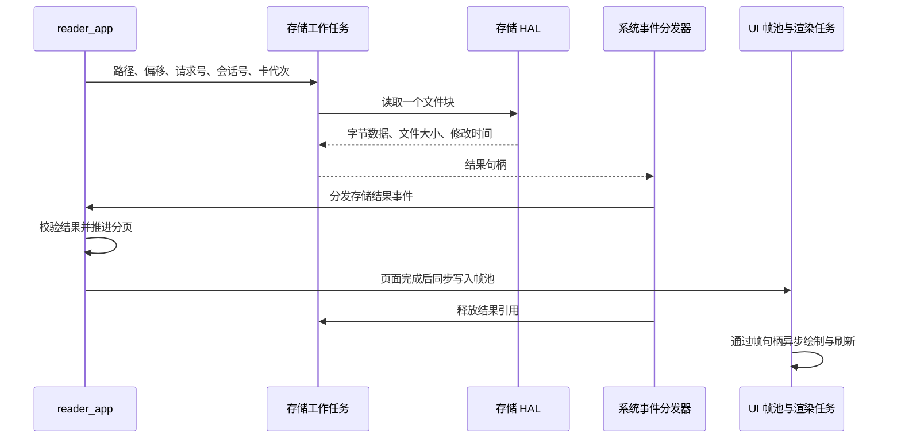

# TXT 阅读器工作方式

TXT 阅读器由文件管理器打开 SD 卡中的文本文件，通过存储服务分块读取，在应用层分页，再由 UI 渲染任务显示。续读位置使用原始文件的字节偏移表示，保存到设备的 NVS 中。

## 入口与加载流程

1. 文件管理器 `file_app` 识别 `.txt` 扩展名，比较时不区分大小写。点击文件后，将完整逻辑路径和 SD 卡代次 `media_generation` 交给 `app_request_open_reader()`。
2. 应用运行时将启动参数复制到 `app_launch_context`，通过 `prepare_launch()` 交给 `reader_app`，然后切换到注册名称为 `ReaderApp` 的应用。路径以 `/` 开头，最多 512 字节；传递的是完整路径，不是界面上排版后的文件名。
3. `reader_app::on_open()` 建立阅读会话、清空回退历史、获取排版参数，并显示加载状态。首次从文件偏移 `0` 请求数据，以取得文件大小和修改时间。
4. 使用路径摘要、文件大小和修改时间查询续读记录。有有效的非零偏移时，从该位置重新请求数据并分页；否则使用首次读取的数据从头分页。
5. 一页内容准备好后，更新页首、下一页偏移和文件结束标记，提交 UI 帧。后续按需读取，不预先加载整本文件或生成全书页码表。

返回操作由应用运行时处理。关闭阅读器后，文件管理器恢复原目录及列表页，并重新获取目录内容。

源码：[文件入口](../app/file/file_app.cpp)、[应用运行时](../app/app.cpp)、[应用注册](../app/app_registry.cpp)、[启动参数](../app/include/app/app_launch_context.hpp)、[阅读器](../app/reader/reader_app.cpp)。

## 架构分层

| 层级 | 阅读器中的职责 | 实现方式 |
| --- | --- | --- |
| `core` | 定义公共数据契约和基础算法 | 提供应用事件、UI 动作、结果句柄、排版参数及 UTF-8 编解码；不持有阅读会话或文件句柄。 |
| `m5_hal` | 封装设备与文件系统操作 | PaperMono 存储实现将逻辑路径映射到 SD 挂载路径，完成文件打开、定位、读取和关闭；显示接口负责设备绘制与刷新。 |
| `services` | 提供存储访问和进度保存 | 存储服务使用工作任务、请求队列和结果池读取数据；进度服务维护固定数量的记录并读写 NVS，在调用任务中同步执行。 |
| `app` | 管理阅读行为与内容状态 | `reader_app` 维护会话、请求、翻页和错误状态；`reader_paginator` 解码并分页；应用运行时负责启动参数和返回导航。 |
| `ui` | 提供排版度量、展示和交互映射 | 提供字宽与行数，将阅读状态复制到帧池，由渲染任务绘制；交互路由把触摸转换为返回、上一页和下一页动作。 |
| `system` | 驱动应用并分发事件 | 系统运行循环更新应用；事件分发器收集输入、存储状态及结果，交给活动应用，分发后释放存储结果引用。 |

阅读状态和分页在应用更新及事件处理过程中推进；SD 读取和屏幕渲染分别由其工作任务执行。应用通过服务接口请求数据，通过 UI 接口提交状态。

源码：[公共事件](../core/include/core/app_event.hpp)、[排版契约](../core/include/core/text_layout.hpp)、[系统循环](../system/system_runtime.cpp)、[事件分发](../system/system_event_dispatcher.cpp)、[交互路由](../ui/ui_interaction_router.cpp)、[UI 渲染](../ui/paper_mono/ui_renderer.cpp)。

## 数据传递与生命周期

### 文件块

`storage_service_read_file_chunk()` 将包含路径的请求按值放入队列。阅读器同一时刻只等待一个文件块结果；单块容量为 2048 字节。一页可以由多个块拼出，也可以在一个块内结束，剩余内容在下一页按文件偏移重新读取。

存储工作任务在共享的 4 槽结果池中构造 `storage_file_chunk_result`。该结构包含实际数据长度、字节数组、文件大小、修改时间、结束标记，以及请求的标识信息。结果队列只传递 `result_handle`，其中的槽位和代次用于定位并校验池内对象。

事件分发器在调用应用期间持有结果引用。阅读器通过类型对应的解析接口取得数据，同步消费后返回；不把结果的裸指针保留到下次更新。分发器随后释放引用，槽位可被复用。

阅读器只有在以下信息均匹配时才处理结果：

| 字段 | 校验目的 |
| --- | --- |
| `session_id` | 区分不同的阅读会话，排除关闭或重新打开前的结果。 |
| `request_id` | 匹配正在等待的那次读取。 |
| `media_generation` | 区分 SD 卡插拔前后的介质状态。 |
| `offset` | 确认结果来自本次请求的文件字节位置。 |

每个文件块都由 HAL 在文件系统互斥锁内完成 `fopen → fstat → fseeko → fread → fclose`。卡卸载使用同一把锁；跨请求不保留打开的文件句柄。存储服务在读取前后检查介质状态和代次。

源码：[存储接口与结果结构](../services/include/services/storage_service.hpp)、[队列与结果池](../services/storage/storage_service.cpp)、[块读取封装](../services/storage/storage_file_reader.cpp)、[PaperMono 存储 HAL](../m5_hal/paper_mono/paper_mono_storage.cpp)。

### 页面帧

阅读器调用 `ui_write_reader_frame()`，其写入回调同步把页面和按钮状态复制到 UI 帧池。提交队列传递帧句柄，渲染任务持有对应引用进行绘制；应用对象和写入回调的上下文指针不进入渲染队列。

屏幕刷新成功后，UI 才更新已呈现帧记录。交互路由依据已呈现帧的控件状态以及视图代次判断动作，阅读器还会检查自身是否正在加载。这样，内容生成、异步显示和触摸处理各自有明确的状态边界。

源码：[阅读视图结构](../ui/include/ui/reader_view.hpp)、[帧池](../ui/paper_mono/ui_frame_pool.cpp)、[渲染调度](../ui/paper_mono/ui_renderer.cpp)、[已呈现帧管理](../ui/ui_presentation.cpp)。

## 解码、排版与翻页

正文使用严格 UTF-8 解码，跨文件块的多字节字符由最多 4 字节的待解码缓冲衔接。非法序列或文件末尾不完整的序列进入 `invalid_utf8` 状态。

文本处理规则如下：

- 仅忽略文件开头的 UTF-8 BOM。
- 识别 LF、CR 和 CRLF 换行，保留空行占用的行数。
- 制表符转换为一个空格；其他小于 `0x20` 的控制字符和 `0x7F` 显示为 `?`。
- 使用字体实际字宽逐字符换行，英文单词也可以在字符之间断行。
- PaperMono 使用 `efontCN_24` 度量与绘制；字体缺少的字符以及大于 `0xFFFF` 的码点显示为 `?`。

PaperMono 正文宽度为 432 像素，每页最多 21 行。通用 `reader_page` 预留 32 条行记录和 2048 字节文本数组，文本数组含结尾的空字符。当行数或文本容量到达边界时，分页器记录下一字符在原文件中的位置，作为下一页入口。

`reader_line.offset` 和 `length` 是本页文本数组内的字节范围，供 UI 绘制使用。页首和下一页偏移则是原文件中的 64 位字节位置；换行归一化、制表符替换等处理不会把文件位置变成页内位置。

下一页从 `next_page_start_offset` 开始读取。成功前进后，把原页首放入最多 64 项的 `reader_page_history`；成功返回上一页后弹出对应项。历史满时移除最早的一项。

续读打开或超出历史范围时，如果当前位置大于零，上一页操作会从文件开头重新分页，定位目标前的一页。该过程使用固定容量的状态，读取量随目标位置增加；历史只存在于本次阅读会话中。

源码：[分页算法与历史](../app/reader/reader_paginator.cpp)、[历史容量](../app/reader/reader_paginator.hpp)、[UTF-8 算法](../core/include/core/utf8.hpp)、[字体度量](../ui/paper_mono/text_layout.cpp)、[页面布局](../ui/paper_mono/layout.hpp)、[页面绘制](../ui/paper_mono/views/reader_renderer.cpp)。

## 进度与书签索引

持久化单元是“一个文件的一处续读位置”，相当于自动续读书签。源码使用 `progress_record` 保存它，记录中没有书签名称或多个位置的集合。上一页历史是另一份内存数据，不写入这条记录。

### 如何识别文件与位置

| 数据 | 实际表示及用途 |
| --- | --- |
| 路径摘要 `path_digest` | 对完整逻辑路径字节计算 SHA-256，保留全部 32 字节；用于匹配文件路径。 |
| `file_size`、`modified_time` | 来自文件元数据；加载续读位置时必须与记录相等。 |
| `offset` | 成功生成页面后的页首字节偏移，为 `uint64_t`，不是页码或百分比。 |
| `sequence` | 记录发生保存更新时递增的序号，用于容量满时选择替换对象。 |
| `version` | 记录格式版本，代码值为 `1`；加载时检查。 |
| NVS 键 `book00`～`book15` | 固定槽位编号；键本身不是路径摘要，也不是书内页号。 |

进度服务首次使用时，从 NVS 命名空间 `reader_v1` 读取最多 16 条记录到内存。查询采用遍历这 16 条记录的方式，比对完整路径摘要、文件大小及修改时间，并检查偏移有效：偏移为 `0`，或者小于文件大小。

例如，逻辑路径 `/books/example.txt` 的续读页首为 `4096`，则某个 `bookNN` 槽保存该路径的摘要、文件元数据和偏移 `4096`。再次打开时，先取得元数据，再遍历记录寻找匹配项，找到后从原文件第 `4096` 字节开始分页。

路径摘要不是文件内容摘要，也不包含 SD 卡的唯一标识。路径改变会改变匹配结果；大小或修改时间改变会使旧记录不被采用。同一路径下大小、修改时间也相同的内容替换，无法通过这组身份字段区分。

### 保存时机与替换规则

`reader_app::on_close()` 在已有有效页首时调用保存服务。页首在页面成功生成后更新；保存时机不依赖屏幕刷新完成回调，也不逐次翻页写入 NVS。

保存按以下规则选择记录：

1. 找到相同路径摘要时，更新原槽位，包括文件元数据和页首。
2. 没有相同路径时，选择 `sequence` 最小的槽位；空槽位的序号为 `0`，优先被使用。
3. 路径、元数据及偏移均与已存记录相同，则直接返回，不写 NVS，也不增加序号。因此替换依据是记录更新顺序，而不是最近打开顺序。
4. 有变化时先更新内存记录，再以 `nvs_set_blob()` 写入选定键，并执行 `nvs_commit()`。

断电后的恢复依赖此前成功提交的记录。NVS 初始化、打开或写入失败时，进度保留在内存中；服务不擦除 NVS，并将持久化状态标记为不可用。UI 读取该状态后显示 `Progress: RAM only`，内存记录在重启后消失。

源码：[文件身份及进度接口](../services/include/services/reading_progress_service.hpp)、[记录、索引与 NVS 实现](../services/reading_progress/reading_progress_service.cpp)、[保存调用与页首更新](../app/reader/reader_app.cpp)。

## 状态与资源边界

阅读视图区分 `loading`、`ready`、`empty_file`、`invalid_utf8`、`file_not_found`、`storage_error` 和 `no_card`。首次打开提交加载帧；后续翻页耗时达到 400 毫秒时才补交加载帧。单次文件块请求等待达到 10 秒时进入读取错误状态。

读取期间检查 SD 卡状态、卡代次以及文件大小和修改时间。介质失效后需重新打开文件；检测到文件元数据变化时停止分页，并取消该会话页首的保存资格。

界面提供返回、上一页和下一页。首页禁用上一页，文件结束后禁用下一页；翻页期间应用不接受新的翻页动作。墨水屏刷新方式由 UI 调度与刷新策略决定。

正文块缓冲、单页数据和回退历史均为固定容量，空间不随 TXT 总长度增长。NVS 最多保留 16 个文件的续读位置，达到容量后按上述保存更新顺序替换。
